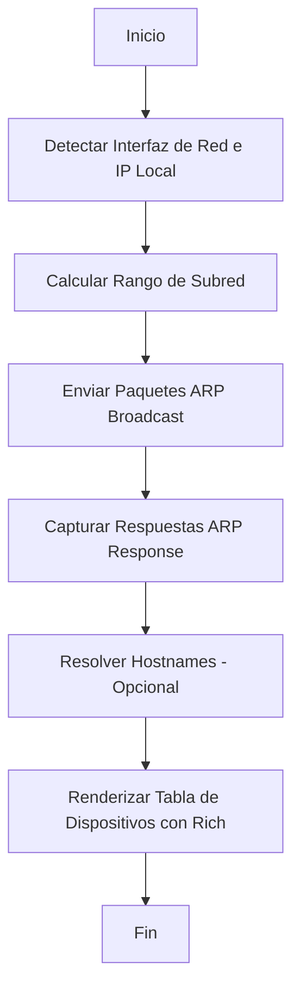

# PYTHON_PLAN: Wi-Fi Device Scanner

## 1. Visión General
Una herramienta de línea de comandos (CLI) de alto rendimiento para identificar dispositivos conectados a la red local (Wi-Fi) mediante escaneo ARP. La interfaz será visualmente atractiva y profesional.

## 2. Stack Tecnológico
- **Core:** `Scapy` (Manipulación de paquetes Layer 2 para escaneo ARP).
- **Interfaz:** `Rich` (Tablas dinámicas, paneles y progreso en tiempo real).
- **CLI Framework:** `Typer` (Manejo de argumentos y comandos de forma moderna).
- **Networking:** `ipaddress`, `socket` (Resolución de hostnames y manejo de subredes).

## 3. Estructura de Archivos Propuesta
```text
wifi_scanner_app/
├── main.py                 # Punto de entrada y CLI (Typer)
├── wifi_scanner/           # Paquete principal
│   ├── __init__.py
│   ├── core.py             # Lógica de escaneo (Scapy)
│   ├── utils.py            # Resolución de hostnames, validación de IPs
│   └── ui.py               # Renderizado de tablas y paneles (Rich)
├── tests/                  # Suite de pruebas (Pytest)
│   ├── __init__.py
│   └── test_scanner.py
└── requirements.txt        # Dependencias
```

## 4. Diagrama de Flujo (Mermaid)


## 5. Dependencias Iniciales
- `scapy`
- `rich`
- `typer`
- `pytest` (para desarrollo)

## 6. Consideraciones de Seguridad
El escaneo ARP requiere privilegios de administrador/root en la mayoría de los sistemas operativos. El programa debe verificar estos permisos al inicio.
